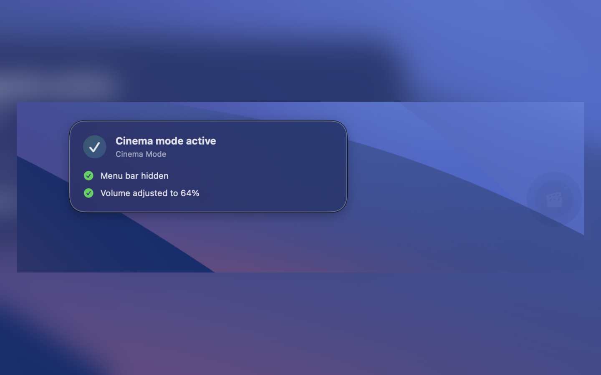
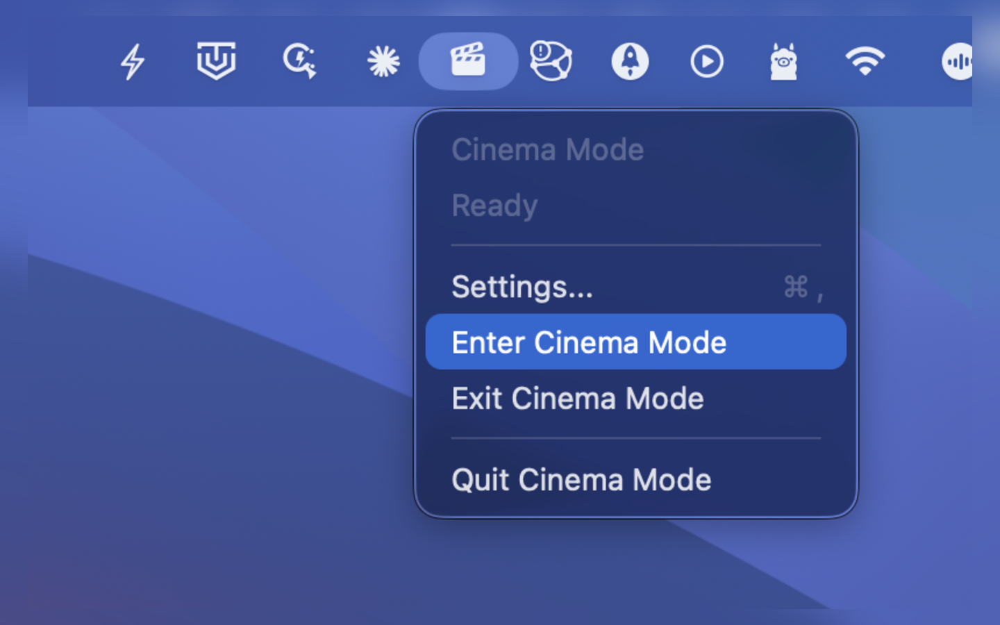

# Cinema Mode for Mac

[](README_ZH.md)
[](https://swift.org)
[](https://developer.apple.com/macos/)
[](https://github.com/GobiCowboy/CinemaMode/releases/latest)

> 🎬 **[Download the latest release](https://github.com/GobiCowboy/CinemaMode/releases/latest)** — or grab it on the [App Store](https://apps.apple.com/cn/mac/search?term=Cinema%20Mode).

A lightweight macOS menu bar app. One click to dim your screen and hide distractions — so you can focus on what you're watching.

## Screenshots

<table>
  <tr>
    <td></td>
    <td></td>
  </tr>
</table>

## What it does

- Hides the menu bar and Dock
- Shows a minimal floating exit button you can drag anywhere
- Restores your system state exactly as it was when you exit
- Remembers your preferred volume and exit button position

## Get it

**Direct download:** Grab the latest release from [GitHub Releases](https://github.com/GobiCowboy/CinemaMode/releases/latest).

**Easiest way:** Search **"Cinema Mode"** on the [Mac App Store](https://apps.apple.com/cn/mac/search?term=Cinema%20Mode) and download it directly.

**From source:** Clone this repo and run `./script/build_and_run.sh`. See [Build & Run](#build--run) below.

## Requirements

- macOS 14 (Sonoma) or later
- Apple Developer account only if you want to code-sign and distribute your own build

## Build & Run

```bash
# Clone and build
git clone https://github.com/<your-username>/CinemaMode.git
cd CinemaMode
swift build

# Run
./script/build_and_run.sh run

# Debug
./script/build_and_run.sh --debug

# View logs
./script/build_and_run.sh --logs
```

### Open in Xcode

```bash
open CinemaMode.xcodeproj
```

## License

[MIT](LICENSE)
