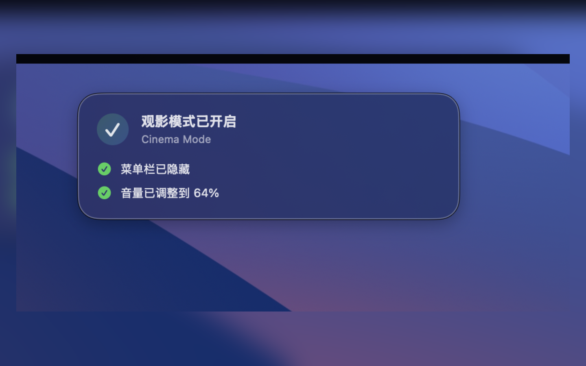
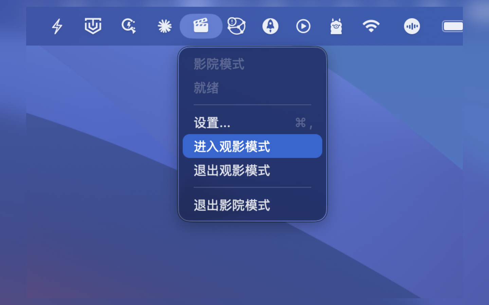

# Cinema Mode

[](README.md)
[](https://swift.org)
[](https://developer.apple.com/macos/)
[](https://github.com/GobiCowboy/CinemaMode/releases/latest)

> 🎬 **[直接下载最新版](https://github.com/GobiCowboy/CinemaMode/releases/latest)** — 或前往 [App Store](https://apps.apple.com/cn/mac/search?term=Cinema%20Mode) 搜索安装。

一款轻量级 macOS 菜单栏工具。一键隐藏菜单栏和 Dock，让屏幕只保留你想看的内容。

打开，点击，观影。就三步。

## 截图

<table>
  <tr>
    <td></td>
    <td></td>
  </tr>
</table>

## 它能做什么

- 隐藏菜单栏和 Dock
- 显示一个极简的悬浮退出按钮，可拖拽到任意位置
- 退出时精确恢复你进入前的系统状态
- 记住你偏好的音量和退出按钮位置

## 下载方式

**直接下载：** 从 [GitHub Releases 页面](https://github.com/GobiCowboy/CinemaMode/releases/latest) 获取最新版本。

**最简单的方式：** 前往 [Mac App Store](https://apps.apple.com/cn/mac/search?term=Cinema%20Mode) 搜索 **「Cinema Mode」** 直接下载。

**从源码构建：** 克隆本仓库后运行 `./script/build_and_run.sh`，详见下方「构建与运行」。

## 系统要求

- macOS 14（Sonoma）或更高版本
- Apple Developer 账号（仅自行签名分发时需要）

## 构建与运行

```bash
# 克隆并构建
git clone https://github.com/<你的用户名>/CinemaMode.git
cd CinemaMode
swift build

# 运行
./script/build_and_run.sh run

# 调试模式
./script/build_and_run.sh --debug

# 查看运行日志
./script/build_and_run.sh --logs
```

### 用 Xcode 打开

```bash
open CinemaMode.xcodeproj
```

## 开源协议

[MIT](LICENSE)

## 如果觉得不错，给个 Star ⭐

如果 CinemaMode 帮你让观影体验更舒服了一点，欢迎给个 Star，你的支持是我持续更新的最大动力 ✨

## ☕ 请我喝杯咖啡

如果你觉得 CinemaMode 帮你省了不少麻烦，欢迎支持一下 ☕

<p align="center">
  
  &nbsp;&nbsp;&nbsp;
  
</p>
